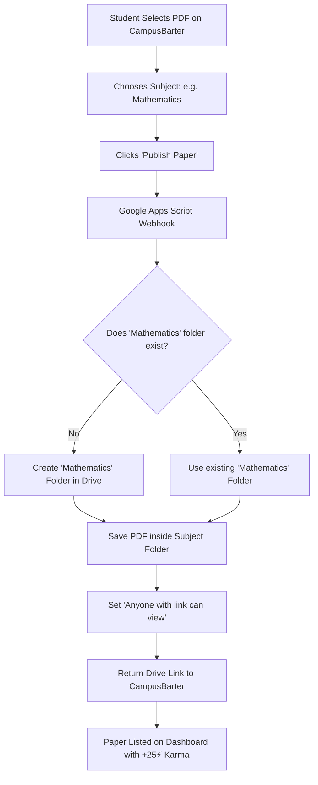

# CampusBarter - Google Drive Automatic Subject-Folder Setup Guide

This guide explains how to automatically receive uploaded question papers from CampusBarter directly into your Google Drive, neatly sorted into separate folders by subject (**Mathematics**, **Computer Science**, **AOP**, etc.).

---

## Architecture Overview



---

## Step 1: Create the Google Apps Script

1. Go to [script.google.com](https://script.google.com) and log in with your Google account.
2. Click **+ New project**.
3. Rename the project to **CampusBarter Drive Uploader**.
4. Delete any code in `Code.gs` and paste the following complete script:

```javascript
/**
 * CampusBarter - Google Drive Auto-Folder Uploader
 * Automatically routes and saves uploaded PDFs into Subject Folders (Mathematics, AOP, CS, etc.)
 */
function doPost(e) {
  try {
    var data = JSON.parse(e.postData.contents);
    var fileName = data.fileName || "Question_Paper.pdf";
    var fileData = data.fileData; // Base64 data URI
    var subject = String(data.subject || "General Studies").trim();
    var code = String(data.code || "").trim();
    var semester = String(data.semester || "").trim();
    var examType = String(data.examType || "").trim();
    var year = String(data.year || "").trim();

    // 1. CampusBarter Master Folder ID (Your existing Google Drive folder)
    var PARENT_FOLDER_ID = "1be2SNRssxdzlKLnCIMjGjkOh7UeJ_N9X";
    
    var parentFolder;
    try {
      parentFolder = DriveApp.getFolderById(PARENT_FOLDER_ID);
    } catch(err) {
      parentFolder = DriveApp.getRootFolder();
    }

    // 2. Clean subject folder name (e.g., "Mathematics", "Computer Science", "AOP")
    var folderName = subject;
    var folders = parentFolder.getFoldersByName(folderName);
    var targetFolder;

    if (folders.hasNext()) {
      targetFolder = folders.next();
    } else {
      // Create a brand new folder for this subject automatically!
      targetFolder = parentFolder.createFolder(folderName);
    }

    // 3. Decode base64 data and create the PDF file
    var base64Content = fileData.indexOf(',') > -1 ? fileData.split(',')[1] : fileData;
    var decoded = Utilities.base64Decode(base64Content);
    var blob = Utilities.newBlob(decoded, "application/pdf", fileName);
    var file = targetFolder.createFile(blob);

    // 4. Set sharing permission to 'Anyone with link can view'
    file.setSharing(DriveApp.Access.ANYONE_WITH_LINK, DriveApp.Permission.VIEW);

    // 5. Return success payload
    return ContentService.createTextOutput(JSON.stringify({
      status: "success",
      fileId: file.getId(),
      fileUrl: file.getUrl(),
      downloadUrl: "https://drive.google.com/uc?export=download&id=" + file.getId(),
      folderName: folderName,
      folderUrl: targetFolder.getUrl()
    })).setMimeType(ContentService.MimeType.JSON);

  } catch (error) {
    return ContentService.createTextOutput(JSON.stringify({
      status: "error",
      message: error.toString()
    })).setMimeType(ContentService.MimeType.JSON);
  }
}

function doGet(e) {
  return ContentService.createTextOutput(JSON.stringify({
    status: "active",
    service: "CampusBarter Google Drive Auto-Uploader is running!"
  })).setMimeType(ContentService.MimeType.JSON);
}
```

---

## Step 2: Deploy as a Web App

1. In the top-right corner of Google Apps Script, click the blue **Deploy** button and select **New deployment**.
2. Click the gear icon (⚙️) next to *Select type* and choose **Web app**.
3. Fill in the deployment configuration:
   * **Description**: `CampusBarter Auto Uploader`
   * **Execute as**: **Me (your-email@gmail.com)**
   * **Who has access**: **Anyone** *(Crucial: allows students on the website to upload into your drive without logging into Google).*
4. Click **Deploy**.
5. Google will ask for authorization — click **Authorize access**, choose your Google account, click **Advanced**, and then click **Go to CampusBarter Drive Uploader (unsafe)** to grant Drive permissions.
6. Copy the generated **Web App URL** (it looks like: `https://script.google.com/macros/s/AKfycb.../exec`).

---

## Step 3: Connected to CampusBarter (Active & Configured)

Your Web App URL is permanently embedded in `script.js`:
```javascript
const GOOGLE_DRIVE_WEBHOOK_URL = "https://script.google.com/macros/s/AKfycbxentAPYMzbQ01LzsRCC5ZU4ranLs9TJgkVJuJI-3aC1u2R_Pnin3MylRXDk2UAXVi-9w/exec";
```

### Verified Live Status:
* **Webhook Endpoint**: `https://script.google.com/macros/s/AKfycbxentAPYMzbQ01LzsRCC5ZU4ranLs9TJgkVJuJI-3aC1u2R_Pnin3MylRXDk2UAXVi-9w/exec`
* **Test Result**: `status: "success"` (Files are auto-sorted into subject folders inside folder `1be2SNRssxdzlKLnCIMjGjkOh7UeJ_N9X`).
* **Instant Fallback**: If offline or if user has no connection, browser blob fallback activates smoothly without blocking the student.

### What happens if the Webhook is not connected yet?
CampusBarter has an automatic **instant fallback system**:
* The uploaded PDF is saved locally in the browser's memory (`blob:URL`).
* The paper is immediately viewable, readable, and downloadable by all users on the dashboard.
* It safely links to your main Google Drive folder without throwing any errors!
