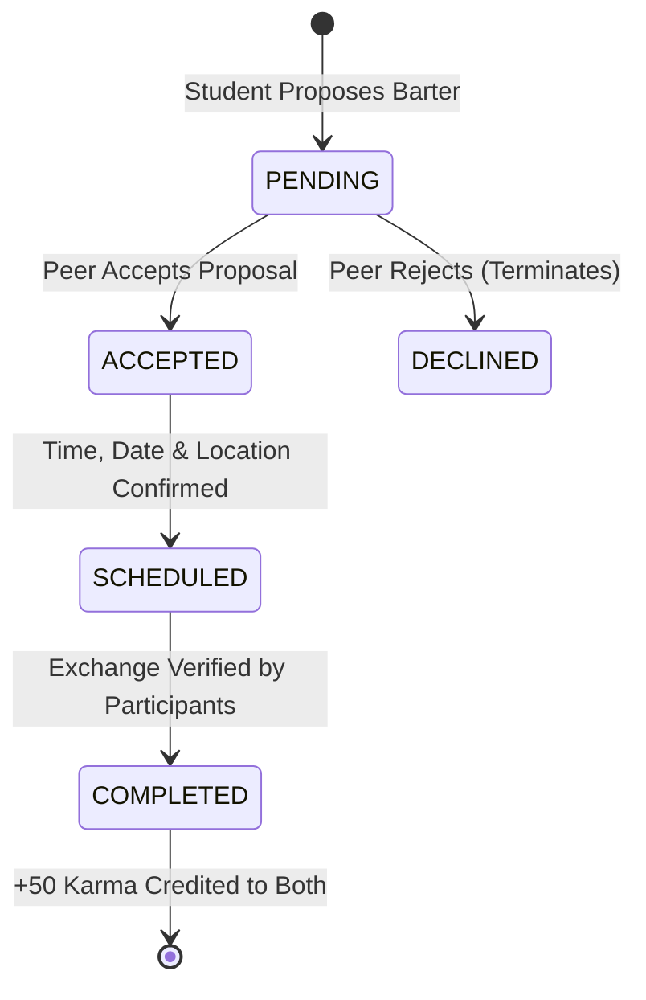

# 📄 Product Requirements Document (PRD)

## Project: CampusBarter (CampusXchange)
**Version:** 2.0.0  
**Target Delivery Date:** October 4, 2026  
**Status:** In Development / Backend Integration Phase  
**Authors:** Aryanraj (Backend Lead & Database Architect) & Shantanu (Frontend Co-Lead)  

---

## 1. Executive Summary & Problem Statement

College students frequently experience two critical academic barriers:
1. **Expensive and Inefficient Tutoring:** Students who excel in one subject (e.g., Computer Systems) often struggle in another (e.g., Linear Algebra) but lack financial resources to hire commercial tutors.
2. **Scattered Exam Materials:** Previous Year Questions (PYQs) and CIA solutions are fragmented across private messaging groups, unreliable drives, or lost between batches.

**CampusBarter** solves this by establishing a decentralized, currency-free academic barter ecosystem powered by a strictly regulated **Karma Economy**.

---

## 2. Target Personas

| Persona | Role | Primary Goal | Key Frustration |
| :--- | :--- | :--- | :--- |
| **Priya (Junior)** | 2nd-year CS Student | Wants past CIA papers and DSA interview problem solutions. | Doesn't know seniors willing to share high-scoring notes. |
| **Aarav (Senior)** | 4th-year AI Major | Wants to practice system design by mentoring, while reviewing database indexing. | No structured platform to schedule peer sessions. |
| **Campus Admin** | Academic Auditor | Ensures no spam, exam leakage during active tests, or abusive karma inflation. | Rogue clients inflating virtual currency or posting spam. |

---

## 3. Core Functional Requirements

### 3.1. User Identity & Profile System
- **FR-1.1:** Student registration requires Name, College Email (`@college.edu`), Department, Semester, Teachable Skills, and Learning Goals.
- **FR-1.2:** New registrants receive an automatic welcome allocation of **`+300 Karma Points`**.
- **FR-1.3:** Quick 1-click account switching for pre-seeded student personas (Aarav, Sneha, Karan) to support offline evaluation and demo presentations.
- **FR-1.4 [Karma Token Refill Engine]:** Automated token refill replenishes Karma at **`+30 Karma / hour`** (credited in **2-hour batches of +60 Karma**) capped at a strict maximum limit of **`120 Karma`**. If the user's balance is $\ge$ 120 Karma, the refill halts automatically ("ek bar 120 pocha toh phir refill ruk jayegi") and reactivates only when balance drops below 120.

### 3.2. 4-Phase Peer Barter State Machine
Every barter follows an enforceable 4-stage pipeline:

- **FR-2.1 [PENDING]:** Requester selects a peer, chooses what skill they will teach, and what skill they want to learn.
- **FR-2.2 [ACCEPTED]:** Peer accepts the barter terms.
- **FR-2.3 [SCHEDULED]:** Participants define meeting time (e.g., `4:30 PM`), date, location (e.g., `Library Discussion Room B`), and session syllabus.
- **FR-2.4 [COMPLETED]:** Both members mark the session as finished, triggering the atomic award of **`+50 Karma Points`** to both parties.

### 3.3. Question Paper Vault (PYQ Repository)
- **FR-3.1:** Multi-parameter search and live filtering by:
  - Free-text query (Subject name, Course code, Uploader name).
  - Subject dropdown (e.g., *DSA*, *Operating Systems*, *DBMS*).
  - Semester dropdown (*Sem 1* through *Sem 8*).
  - Exam type (*CIA-1*, *CIA-2*, *Semester End*).
- **FR-3.2 Paper Upload:** Authenticated students can publish verified papers. Each verified upload credits **`+25 Karma Points`** to the uploader.
- **FR-3.3 Paper Download:** Downloading an exam paper costs **`15 Karma Points`**.
  - **Constraint:** If a student's balance is `< 15 Karma`, the download is blocked with an explicit error alert.

### 3.4. Dual-Mode (Cloud + Offline) Operational Mandate
- **FR-4.1 Cloud Mode:** Powered by Supabase PostgreSQL with real-time sync, Row Level Security, and PostgreSQL stored procedures.
- **FR-4.2 Offline Mode:** When network connection drops or when evaluated in local testing:
  - App continues full read/write functionality using `localStorage`.
  - Offline transactions (downloads, completed swaps) are stored in an idempotent offline queue (`cb_offline_queue`).
  - Upon reconnection (`window.online`), the queue synchronizes to Supabase automatically.
- **FR-4.3 Zero External Assets:** All avatar images, logos, and background art must be served locally from `./assets/images/` without depending on external CDN bandwidth.

---

## 4. Karma Economy Specification

To ensure a non-inflationary, self-sustaining virtual economy:

| Action | Economy Impact | Validation Mechanism |
| :--- | :--- | :--- |
| **New Account Registration** | `+300 Karma` | Trigger `handle_new_user()` executed once on `auth.users` insert. |
| **Karma Token Refill** | `+30 Karma / hr` (`+60 Karma` every 2h, max cap `120⚡`) | Refill cycle verification, pauses automatically whenever balance $\ge$ 120 Karma. |
| **Publish Question Paper** | `+25 Karma` | Trigger `reward_pyq_upload()` on `public.pyqs` insert. |
| **Download Question Paper** | `-15 Karma` | Stored procedure `download_pyq_secure()` with row lock `FOR UPDATE` and balance check `>= 15`. |
| **Finalize Barter Swap** | `+50 Karma` (each) | Stored procedure `complete_swap_secure()` ensuring caller authorization and single completion. |

---

## 5. Non-Functional Requirements (NFR)

1. **Security & Data Integrity:**
   - Client applications must NEVER execute direct SQL or modify sensitive columns like `karma`.
   - All dynamic text rendered to HTML must undergo entity sanitization to eliminate XSS vectors.
2. **Performance:**
   - Search filtering in the PYQ repository must execute sub-50ms on the client.
   - Initial page render time must be under 1.2 seconds in offline mode.
3. **Resilience:**
   - Network failure during a download or swap must fail gracefully with descriptive toast notifications.
4. **Usability:**
   - 100% responsive design across Mobile (360px+), Tablet, and Desktop (1920px).

---

## 6. Acceptance Criteria

- [x] Initial account creation seeds user with exactly 300 Karma.
- [x] Automated Karma token engine replenishes +30 Karma/hour in 2-hour batches (+60 Karma per cycle) with countdown timers, strictly halting once balance reaches 120 Karma.
- [x] Downloading a paper deducts exactly 15 Karma and increments download counter.
- [x] A user with less than 15 Karma attempting a download is rejected with an explanatory message.
- [x] Completing a barter awards +50 Karma to both participant profiles.
- [x] Disconnecting Wi-Fi does not break UI browsing or local demo testing.
- [x] All images load with 200 OK status from local `./assets/images/` folder.
